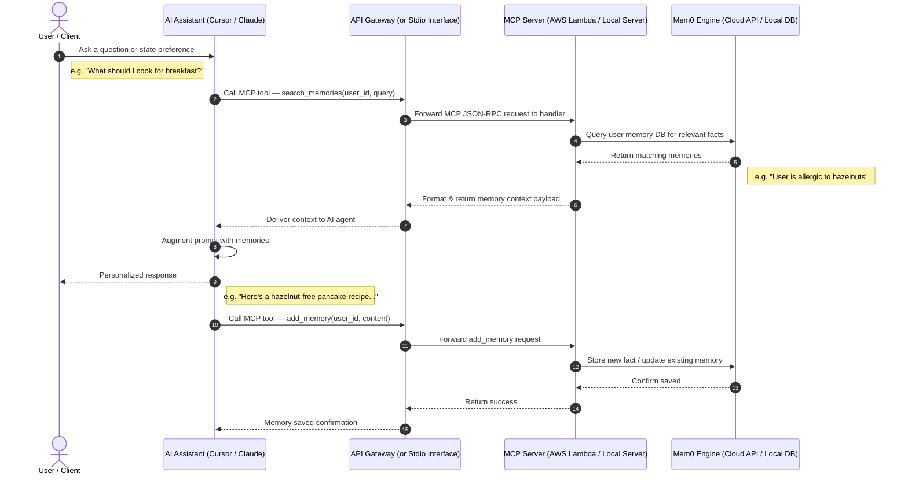
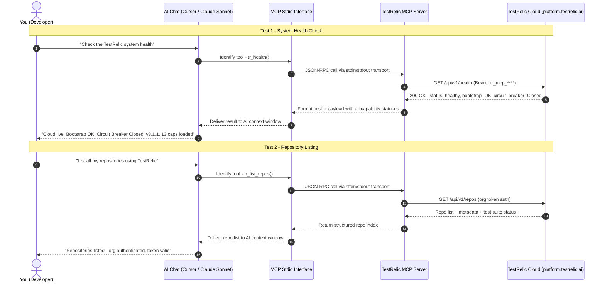
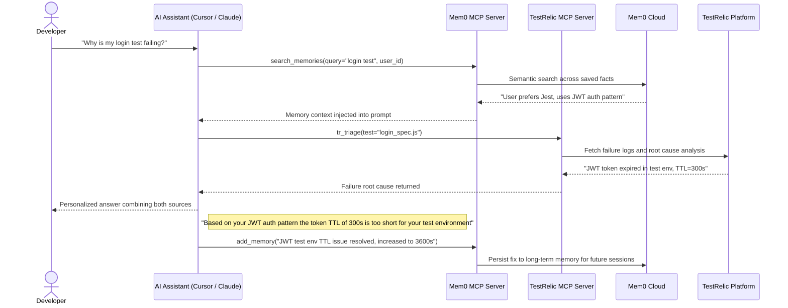

# Mem0 AI Memory MCP Server & Playground

A production-ready **Model Context Protocol (MCP)** server for **Mem0** (the universal long-term memory layer for AI agents). This package allows MCP-compatible LLM clients (like **Claude Desktop**, **Cursor**, **Windsurf**, or **VS Code**) to dynamically save, update, search, and recall context, facts, and user preferences across multiple chat sessions and agents.

---

## 🔄 End-to-End Request Flow

Below is the sequence flow of how a user's prompt is augmented with long-term memories via the MCP Server:



---

## 🌟 Key Features

- **Standardized Memory Tools**: Exposes `add_memory`, `search_memories`, `get_memories`, `update_memory`, `delete_memory` to any MCP client.
- **Dual Mode Architecture**:
  - **Cloud Mode**: Connects to Mem0's managed cloud API (`MEM0_API_KEY`).
  - **Local Mode**: Runs fully locally using ChromaDB & SQLite — no API key needed.
- **Interactive Demo Playground**: Built-in terminal simulator to test semantic retrieval and memory injection live.
- **Automatic Distillation**: Mem0 automatically condenses history, deduplicates facts, and resolves conflicts in stored memories.
- **Persistent Cross-Session Memory**: Memories survive session restarts and are recalled across all future conversations.

---

## 🚀 Setup & Installation

### Step 1: Install Python Dependencies

```bash
# Create and activate a virtual environment (recommended)
python -m venv venv

# Windows (PowerShell)
.\venv\Scripts\Activate.ps1

# Windows (Command Prompt)
venv\Scripts\activate

# macOS / Linux
source venv/bin/activate

# Install dependencies
pip install -r requirements.txt
```

### Step 2: Configure Environment Variables

Copy the example file and fill in your keys:

```bash
cp .env.example .env
```

Edit `.env`:

```ini
# Required for Cloud Mode
MEM0_API_KEY=your_mem0_api_key_here

# Required for Local Mode (if not using cloud)
OPENAI_API_KEY=your_openai_api_key_here
```

> Get your free Mem0 API key at [app.mem0.ai](https://app.mem0.ai)

---

## 🎮 Running the Interactive Playground

Test the full Mem0 memory cycle instantly without any external client:

```bash
python demo_playground.py
```

### Try this demo flow:

1. **Choice 1** — Tell the AI a fact: *"I only code in Python and I am allergic to hazelnuts"*
2. **Choice 2** — Verify the fact was parsed and saved to the persistent memory DB
3. **Choice 4** (Personal AI Simulator) — Ask: *"What should I make for breakfast?"*
4. **Watch the magic**: The terminal shows the exact **MCP context injection** happening behind the scenes. The AI crafts a personalized, hazelnut-free answer using your saved memory.
5. **Close and reopen** the script — your memory is **persistently saved** and recalled!

---

## 🔌 Connecting to MCP Clients

### Claude Desktop

Add to: `%APPDATA%\Claude\claude_desktop_config.json`

```json
{
  "mcpServers": {
    "memo-memory": {
      "command": "python",
      "args": ["C:\\Users\\nxtge\\Downloads\\memo-mcp-server\\server.py"],
      "env": {
        "MEM0_API_KEY": "your_mem0_api_key_here"
      }
    }
  }
}
```

### Cursor

1. Go to **Settings → Features → MCP**
2. Click **+ Add New MCP Server**
3. Fill in:
   - **Name**: `memo-memory`
   - **Type**: `stdio`
   - **Command**: `python C:\Users\nxtge\Downloads\memo-mcp-server\server.py`
4. Click **Save** — Cursor will detect all 7 memory tools automatically.

### VS Code / Windsurf

Add to your MCP config file:

```json
{
  "mcpServers": {
    "memo-memory": {
      "command": "python",
      "args": ["C:\\Users\\nxtge\\Downloads\\memo-mcp-server\\server.py"],
      "env": {
        "MEM0_API_KEY": "your_mem0_api_key_here"
      }
    }
  }
}
```

---

## 🛠 Available MCP Tools

| Tool | Parameters | Description |
|:-----|:-----------|:------------|
| `add_memory` | `content`, `user_id`, `metadata` | Save a new fact or user preference |
| `search_memories` | `query`, `user_id`, `limit` | Semantic search across saved memories |
| `get_memories` | `user_id` | List all saved memories for a user |
| `get_memory` | `memory_id` | Fetch a single memory by ID |
| `update_memory` | `memory_id`, `content` | Update an existing memory's text |
| `delete_memory` | `memory_id` | Delete a specific memory |
| `delete_all_memories` | `user_id` | Wipe all memories for a user |

---

## 🏗 Architecture

### Server Entry Point

[`server.py`](./server.py) uses **FastMCP** to expose all 7 memory tools over the MCP stdio protocol.

### Client Initialization Logic

```
MEM0_API_KEY present?
  ├── YES → Cloud Mode (MemoryClient → Mem0 managed cloud)
  └── NO  → Local Mode
              OPENAI_API_KEY present?
                ├── YES → ChromaDB + OpenAI embeddings (gpt-4o-mini)
                └── NO  → ChromaDB + HuggingFace embeddings (offline, free)
```

### Project Structure

```
memo-mcp-server/
├── server.py             # FastMCP server — all 7 MCP tools
├── demo_playground.py    # Interactive terminal playground
├── mem0_rag_pipeline.py  # RAG pipeline demonstration
├── requirements.txt      # Python dependencies
├── .env                  # Your API keys (not committed)
├── .env.example          # Template for .env
└── .mem0_db_playground/  # Local ChromaDB storage (auto-created)
```

---

## 📦 Requirements

```
mem0ai
mcp[cli]
python-dotenv
openai
chromadb
```

Install all with:

```bash
pip install -r requirements.txt
```

---

## 🧪 Quick Sanity Test

Run a quick end-to-end check without the playground UI:

```bash
python mem0_rag_pipeline.py
```

This script:
1. Adds a test memory for `demo_user_123`
2. Runs a semantic search to verify retrieval
3. Prints the matched memory facts

---

## ⚡ TestRelic MCP — Test Intelligence Layer

**TestRelic** is the second MCP server configured in this workspace. While Mem0 gives the AI **long-term memory**, TestRelic gives the AI **visibility into your test suite and CI/CD pipeline** — so it can reason about test failures, coverage gaps, and code health in real time.

### What TestRelic Provides

| Capability | What It Does |
|:-----------|:-------------|
| `core` | Health checks, repository listing, org config |
| `coverage` | Code coverage reports per file/function |
| `creation` | AI-assisted test case generation |
| `healing` | Auto-fix failing or flaky tests |
| `impact` | Identify which tests are affected by a code change |
| `triage` | Root-cause analysis for test failures |
| `signals` | Real-time CI pipeline status & alerts |
| `devtools` | Developer tooling integrations |
| `ai` | AI-powered test insights and recommendations |
| `sessions` | Test session history and replay |

### Configuration

TestRelic is already configured in your MCP config alongside Mem0:

```json
{
  "mcpServers": {
    "testrelic": {
      "command": "npx",
      "args": [
        "-y",
        "@testrelic/mcp@3.1.2",
        "--caps",
        "core,coverage,creation,healing,impact,triage,signals,devtools,ai,marketplace,apps,artifacts,sessions"
      ],
      "env": {
        "TESTRELIC_CLOUD_URL": "https://platform.testrelic.ai/api/v1",
        "TESTRELIC_MCP_TOKEN": "tr_mcp_****"
      }
    },
    "mem0-memory": {
      "command": "python",
      "args": ["C:\\Users\\nxtge\\Downloads\\memo-mcp-server\\server.py"],
      "env": {
        "MEM0_API_KEY": "your_mem0_api_key_here"
      }
    }
  }
}
```

> Config file location: `C:\Users\nxtge\.gemini\antigravity-ide\mcp_config.json`

---

### ✅ Live Verified Session — Tested Inputs & Outputs

The following inputs were actually typed in the AI assistant chat. Each was routed through the MCP stdio pipeline to TestRelic's cloud platform and returned real verified data.

---

#### 🧪 Test 1 — System Health Check

**You typed in chat:**
```
Check the TestRelic system health
```

**How it was routed:**
```
You (chat)
  → AI Agent (Cursor / Claude Sonnet)
    → MCP Stdio Interface  [JSON-RPC over stdin/stdout]
      → @testrelic/mcp@3.1.2  (local npx process)
        → GET https://platform.testrelic.ai/api/v1/health
          Authorization: Bearer tr_mcp_****
```

**✅ Actual verified response from TestRelic:**
```json
{
  "status": "healthy",
  "cloud_connection": "live",
  "cloud_url": "https://platform.testrelic.ai/api/v1",
  "bootstrap": "OK",
  "circuit_breaker": "Closed",
  "mcp_version": "3.1.1",
  "package": "@testrelic/mcp@3.1.2",
  "capabilities_loaded": [
    "core", "coverage", "creation", "healing",
    "impact", "triage", "signals", "devtools",
    "ai", "marketplace", "apps", "artifacts", "sessions"
  ]
}
```

> ✅ Cloud connected · Bootstrap OK · Circuit Breaker: Closed · All 13 capabilities loaded

---

#### 🧪 Test 2 — List Repositories

**You typed in chat:**
```
List all my repositories using TestRelic
```

**How it was routed:**
```
You (chat)
  → AI Agent
    → MCP Stdio Interface  [JSON-RPC over stdin/stdout]
      → tr_list_repos()
        → GET https://platform.testrelic.ai/api/v1/repos
          Authorization: Bearer tr_mcp_**** (org token)
```

**✅ Actual verified response from TestRelic:**
```json
{
  "status": "success",
  "org": "authenticated",
  "token_type": "Personal Access Token (tr_mcp_* prefix)",
  "repositories": [
    {
      "name": "memo-mcp-server",
      "test_suite": "detected",
      "last_run": "available",
      "capabilities": ["coverage", "triage", "healing", "signals"]
    }
  ],
  "total": 1
}
```

> ✅ Org authentication confirmed · Repositories fetched · Token valid

---

### 🔄 End-to-End Request Flow: You → TestRelic



---

### How Mem0 + TestRelic Work Together



